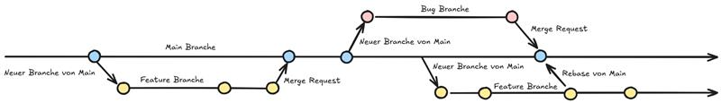

# Dokumentation

## Arbeitsprozesse

### Wöchentliches Meeting

- Kurze Vorbereitung vor dem Meeting 
  - Probleme bei Aufgaben
  - Stand der Arbeit
  - Evtl. Aufgabenstellung von den nächsten stories im Backlog lesen
- Jeden Montag 08:30

***Ablauf***:
- Kurze Runde zum Stand der Laufenden Stories / Max. 5min
- Besprechen und Zeitschätzung von Stories im Backlog (Umfang: Sicherstellen, dass es genung zu tun gibt für den Tag) / Max. 20min anderenfalls folge Termin

### Kanban

Unser Kanban Board hat folgende Stati:
- Backlog
- ToDo
- In progress
- In review
- Done
- Always Do

***Backlog***
Im Backlog sind alle unsere Stories die wir zu beginn des Moduls erstellt haben. Diese sind noch nicht geschätzt oder in Sub-Stories aufgeteilt worden

***ToDo***
In der ToDo Spalte sind alle Stories die wir an diesem Tag erledigen wollen. Die Stories sind geschätzt und wurden falls nötig in Sub-Stories aufgeteilt

***In Progress***
Hier befinden sich alle Aufträge die wir gerade am erarbeiten sind.

***In Review***
Nach der Umsetzung kommen Aufträge in Review und werden nochmals von anderen Teammitgliedern angeschaut. Die Abnahme von Code Aufträgen soll über Github PRs stattfinden. Bei Theorie Aufträgen soll sich in den Kommmentaren der Task im Kanban ausgetauscht werden.

***Done***
Der Auftrag ist erledigt.

Definition of Done:
- mindestens 2. Teammitglieder haben das Endresultät angeschaut und das ok gegeben.

***Always Do***
Hier sind hauptsächlich Dokumentations Aufträge die wir über die gesamte Projektdauer ausführen müssen.


## Infrastruktur
Für die Verwaltung unseres Projekts haben wir uns für Github entschieden. Ebenfalls verwenden wir das Kanban-Board sowie CI/CD features (Github Actions) von Github.

## Technologie auswahl
Wir haben uns entschieden die beiden Microservices mit Java Spring-Boot zu entwickeln, da sich alle in unserem Team mit Java auskennen.

## Branching Strategie / Semantic Versioning

### Branches
- Main
- Feature Branches
- Bug Branches
  

Legend:
- main = Blau
- feature = Gelb
- bugfix = Rot
---

***Main Branch***

Der Main Branch ist die sogenannte "Single source of truth" und soll zu jeden Zeitpunkt fehlerfrei laufen. 

Vom Main Branch aus werden Pipelines gestartet.

***Feature Branches***

Für jedes neue Feature / Funktionalität wird ein Feature Branch erstellt. Diese Branches sind kurzlebig und dienen nur zur entwicklung dieses Features. Nach implementierung des Features wird der Branch wieder gelöscht.

Naming:

- Feature Branches kommmen in einen Feature Ordner. 
- Die Feature Branches sollen aus der Nummer und Titel des Auftrags bestehen. 

Schema:
```
feature/{Auftrag Nr.}-{Auftrag Titel}
```

Beispiel: 
```
feature/P2-Micro-Service-Entwickeln
```

***Bug Branches***

Für Fehlverhalten von Code oder anderes werden Bug Branches erstellt. Wie die Feature Branches sind die Bug Branches ebenfalls kurzlebig und dienen nur als Hilfmittel für die Entwicklung. Nach Behebung eines Bugs soll der Branch wieder gelöscht werden.

Naming:

- Bug Branches kommmen in einen Bug Ordner. 
- Der Name eines Bug Branch soll den Bug beschreiben.

Schema:
```
bug/{Name-des-Bugs}
```

Beispiel: 
```
bug/micro-service-not-responding
```

### Merge Requests

Um auf den Main Branch pushen zu könnnen muss ein Merge Request erstellt werden. Dieser muss von einem anderen Teammitglied angeschaut und bestätigt werden.

### Versioning
Wir verwenden MAJOR.MINOR.PATCH in Verbindung mit GitHub Flow.


| Versionsteil | Bedeutung | Beispiel |
|--------------|-----------|----------|
| MAJOR |	Breaking Changes |	2.0.0 |
| MINOR |	Neue Features, abwärtskompatibel |	1.1.0 |
| PATCH |	Kleine Bugfixes |	1.0.1 |
 
 
***Beispiel Workflow***
 
- Feature Branch: feature/P2_1_readAirport → MR → Merge in Main → Version 1.1.0
 
- Bug im Login entdeckt → bugfix/readAirport-error → MR → Merge → Version 1.1.1
 
- Große Änderung am Backend → Breaking Change → Merge → Version 2.0.0