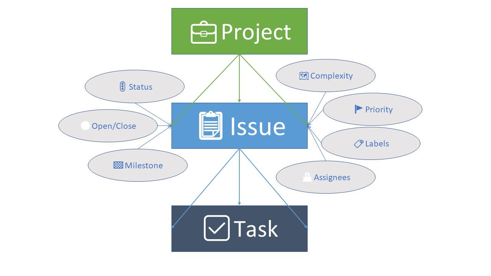

# Z2: Ticketsystem / Continuous Improvement

## 1️⃣ Evaluation des Ticketsystems

Für die Aufgabenstellung wird GitHub Issues als Ticketsystem ausgewählt.

**Begründung:**

* Direkt in GitHub integriert -> keine zusätzliche Plattform erforderlich
* Branches und Commits können automatisch mit Tickets verknüpft werden
* CI/CD-Pipeline bleibt integriert und automatisiert
* Kennzahlen wie offene Tickets, Durchlaufzeiten und Eskalationen können leicht exportiert werden
* Einfacher Zugang für 1st Level Supporter und Entwickler


---

## 2️⃣ Prozessbeschreibung

### 2.1 Ticket-Erstellung

* Kunde erstellt ein GitHub Issue im Repository (`airport-service` oder `flight-service`)
* Ticket enthält:

  * Beschreibung des Problems
  * Priorität
  * Optional Screenshots oder Logs

### 2.2 1st Level Support

* Prüft und klassifiziert das Ticket
* Kann einfache Probleme direkt lösen
* Eskaliert komplexe Tickets an den 2nd Level Support (Entwickler)

### 2.3 2nd Level / Entwickler

* Entwickler erstellt Branch für das Ticket:

  ```
  bugfix/<ticket-nummer>-kurze-beschreibung
  z. B.: bugfix/145-fix-login
  ```
* Commit-Nachricht enthält Ticket-ID:

  ```
  git commit -m "Fixes #145: Correct login issue"
  ```
* GitHub verknüpft Commit automatisch mit dem Ticket

### 2.4 Pull Request / Code Review

* Branch wird in `develop` oder `main` gemerged
* CI/CD Pipeline läuft automatisch:

  * Unit Tests
  * Integration Tests / wenn vorhanden
  * Build
  * Deployment (DEV/QA/Prod) / wenn vorhanden
* Code Review stellt Qualität sicher

### 2.5 Deployment

* Merge in `develop` → Deployment in Dev
* Merge in `main` → Deployment in Prod

### 2.6 Ticket-Status

* Ticket wird automatisch kommentiert oder geschlossen:

  ```
  Closes #145
  ```
* Statusänderungen sind für alle Teammitglieder sichtbar

---

## 3️⃣ Branching und Commit-Verknüpfung

**Branch-Strategie:**

* Feature/Fix Branches basierend auf Ticket-ID:

  ```
  feature/<ticket-id>-beschreibung
  bugfix/<ticket-id>-beschreibung
  ```
* Commit-Nachrichten enthalten Ticket-ID:

  ```
  git commit -m "Fixes #<ticket-id>: kurze Beschreibung"
  ```
* Pull Requests referenzieren Ticket automatisch

---

## 4️⃣ Kennzahlen für Continuous Improvement

**Metriken, die GitHub Issues liefert:**

* Anzahl offener Tickets pro Woche/Monat
* Durchlaufzeit: Ticket-Erstellung → Fix → Deployment
* Anzahl Eskalationen 1st Level → 2nd Level
* CI/CD-Status pro Ticket (Tests bestanden/fails)
* Verknüpfte Commits und Pull Requests

**Verwendung:**

* Kennzahlen fliessen in Team-Retrospektiven ein
* Verbesserungspotenzial wird sichtbar (z. B. Prozesse optimieren, häufige Fehlerquellen identifizieren)
* Unterstützung der kontinuierlichen Verbesserung (Continuous Improvement)

---

## 5️⃣ Prozessübersicht (Tabelle)

| Schritt                    | Verantwortlich      | Tool / Branch             | Verknüpfung             |
| -------------------------- | ------------------- | ------------------------- | ----------------------- |
| Ticket erstellen           | Kunde               | GitHub Issue              | #TicketID               |
| Ticket prüfen              | 1st Level Support   | GitHub Issue              | Status / Label          |
| Ticket eskalieren          | 1st → 2nd Level     | GitHub Issue              | Label / Eskalation      |
| Fix entwickeln             | Entwickler          | Branch: bugfix/<TicketID> | Commit: Fixes #TicketID |
| Pull Request / Code Review | Entwickler & Team   | PR im Repository          | Automatisch verknüpft   |
| Deployment                 | CI/CD Pipeline      | GitHub Actions            | Automatisch             |
| Ticket schliessen           | Entwickler / GitHub | Issue Status              | Closes #TicketID        |

### ProzessDiagramm

```
Kunde 👤
   │
   ▼
🎫 Ticket erstellt (GitHub Issues)
   │
   ▼
1st Level Support 🧑‍💻
   │
   ├─ Löst einfaches Problem ✅
   │
   └─ Eskaliert komplexes Ticket -> 2️nd Level Entwickler 👨‍💻
           │
           ▼
       🌿 Branch erstellen (feature/bugfix)
           │
           ▼
       💾 Commit & Pull Request
           │
           ▼
       ⚡ CI/CD Pipeline
           │
           ▼
       🚀 Deployment (Dev → QA → Prod)
           │
           ▼
       🎫 Ticket geschlossen / aktualisiert
```

---

## 7️⃣ Fazit

Mit GitHub Issues als Ticketsystem können Tickets einfach erstellt, eskaliert und bearbeitet werden.
Die Integration in Branching, Commits, Pull Requests und CI/CD Pipeline stellt sicher, dass der Fix korrekt umgesetzt wird.
Kennzahlen aus dem Ticketsystem unterstützen die kontinuierliche Verbesserung im DevOps-Prozess.

## Quelle 
https://github.com/features/issues