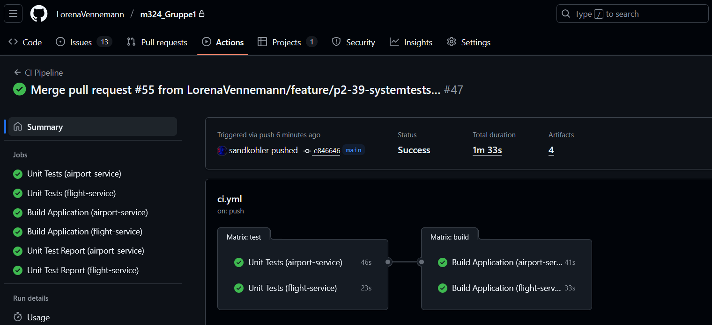
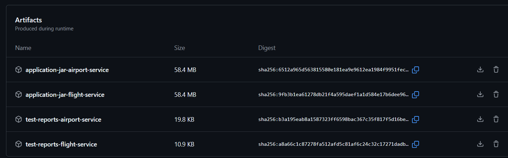
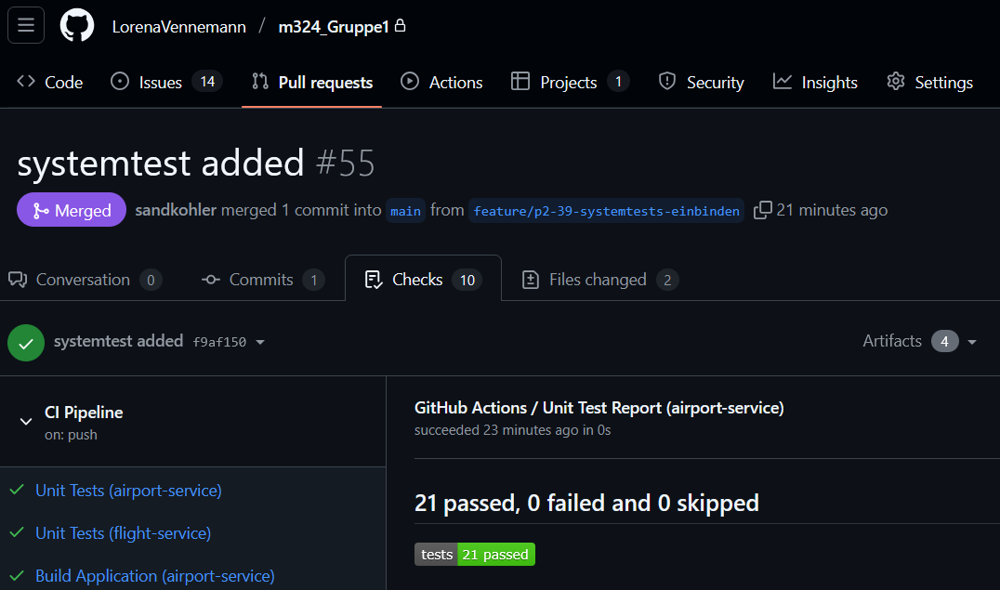

# CI Pipeline - Anleitung

## Übersicht

Dieses Dokument beschreibt, wie auf unsere CI-Pipeline zugegriffen und getestet werden kann.

## Voraussetzungen

- GitHub Account mit Zugriff auf dieses Repository
- User wurde als **Collaborator** mit mindestens **Write-Zugriff** hinzugefügt

## Zugriff auf die CI-Pipeline

### Pipeline-Übersicht einsehen

1. Navigiere auf GitHub im Repository zum Tab **"Actions"** (oben in der Menüleiste)
2. Dort ist zu sehen:
    - Eine Liste aller bisherigen Pipeline-Läufe
    - Den Status jedes Laufs (✅ Success, ❌ Failed, 🟡 In Progress)
    - Welcher Branch/Commit den Lauf ausgelöst hat


### Einzelnen Pipeline-Lauf inspizieren

1. Klicke auf einen beliebigen Pipeline-Lauf in der Liste
2. Folgende Ansicht erscheint:
    - **Jobs-Übersicht**: Alle Jobs (test, build) für beide Services
    - **Matrix-View**: Parallele Ausführung für `airport-service` und `flight-service`
3. Klicke auf einen Job (z.B. "Unit Tests (airport-service)"), um:
    - Die kompletten Logs einzusehen
    - Jeden einzelnen Step zu überprüfen
    - Fehlerausgaben zu analysieren



### Artefakte herunterladen

Nach einem erfolgreichen Build stehen folgende Artefakte zur Verfügung:

1. Scrolle in einem Pipeline-Lauf ganz nach unten zum Abschnitt **"Artifacts"**
2. Verfügbare Artefakte:
    - `test-reports-airport-service`: Detaillierte HTML-Test-Reports
    - `test-reports-flight-service`: Detaillierte HTML-Test-Reports
    - `application-jar-airport-service`: Gebaute JAR-Datei
    - `application-jar-flight-service`: Gebaute JAR-Datei
3. Klicke auf ein Artefakt, um es als ZIP-Datei herunterzuladen

**Hinweis**: Artefakte werden automatisch nach 7 Tagen (Test-Reports) bzw. 30 Tagen (JAR-Dateien) gelöscht.



## Pipeline manuell triggern

Um die Pipeline selbst auslösen zu können:

### Option 1: Änderung in einem Service vornehmen

1. Erstelle einen neuen Branch:
   ```bash
   git checkout -b feature/test-pipeline
   ```

2. Nimm eine kleine Änderung in einem Service vor, z.B.:
    - Füge einen Kommentar in `Code/airport-service/src/main/java/...` hinzu
    - Oder ändere eine Test-Datei

3. Committen und pushen:
   ```bash
   git add .
   git commit -m "Test: Pipeline trigger"
   git push origin feature/test-pipeline
   ```

4. Die Pipeline startet automatisch

### Option 2: Pull Request erstellen

1. Nachdem ein Feature-Branch gepusht wurde (siehe Option 1)
2. Gehe auf GitHub zu **"Pull requests"** → **"New pull request"**
3. Wähle:
    - Base: `main`
    - Compare: Erstellter Feature-Branch
4. Erstelle den Pull Request
5. Die Pipeline läuft automatisch und zeigt die Ergebnisse direkt im PR an



## Was die Pipeline macht

### Phase 1: Unit Tests (Job: `test`)

**Für jeden Service parallel:**

1. ✅ Repository auschecken
2. ✅ Java 21 (Temurin) installieren
3. ✅ Gradle Cache nutzen für schnellere Builds
4. ✅ Alle Unit Tests mit `./gradlew test` ausführen
5. ✅ Test-Report erstellen (sichtbar im Pull Request)
6. ✅ Detaillierte Test-Coverage hochladen

**Ergebnis**: Es ist sofort ersichtlich, ob alle Tests erfolgreich sind.

### Phase 2: Build Application (Job: `build`)

**Läuft nur, wenn Tests erfolgreich waren!**

**Für jeden Service parallel:**

1. ✅ Repository erneut auschecken
2. ✅ Java 21 installieren
3. ✅ Application mit `./gradlew build -x test` bauen
4. ✅ JAR-Datei umbenennen (mit Commit-Hash, z.B. `airport-service-a1b2c3d.jar`)
5. ✅ JAR als Artefakt speichern
6. ✅ Build-Informationen ausgeben (Grösse, Zeit, etc.)

**Ergebnis**: Lauffähige JAR-Dateien stehen zum Download bereit.

## Trigger-Regeln

Die Pipeline wird **automatisch** gestartet bei:

| Event | Branches | Bedingung |
|-------|----------|-----------|
| **Push** | `main`, `feature/*`, `bug/*` | Änderungen in `Code/airport-service/**` oder `Code/flight-service/**` |
| **Pull Request** | Target: `main` | Änderungen in `Code/airport-service/**` oder `Code/flight-service/**` |

**Wichtig**: Änderungen nur in der Dokumentation (z.B. `README.md`) lösen **keinen** Build aus.

## Test-Reports im Pull Request

Bei Pull Requests erscheint automatisch ein Test-Report:

1. Öffne einen Pull Request
2. Scrolle zu den **Checks** am Ende der PR-Seite
3. Dort sind zwei Einträge:
    - ✅ "Unit Test Report (airport-service)"
    - ✅ "Unit Test Report (flight-service)"
4. Klicke auf "Details", um eine Zusammenfassung der Tests zu sehen
5. Bei Fehlern werden die betroffenen Tests direkt angezeigt

## Häufige Fragen

### Wie lange dauert ein Pipeline-Lauf?

- **Unit Tests**: Ca. 20-50 Sekunden pro Service
- **Build**: Ca. 30-50 Sekunden pro Service
- **Gesamt**: Ca. 1-2 Minuten (Jobs laufen parallel)

### Was passiert bei einem Fehler?

1. Der fehlerhafte Job wird rot markiert (❌)
2. Nachfolgende Jobs (z.B. `build`) werden **nicht** ausgeführt
3. Im Pull Request erscheint der Fehler
4. Die Logs zeigen genau, welcher Test/Step fehlgeschlagen ist

### Kann ich alte Pipeline-Läufe erneut starten?

Ja! In der Actions-Übersicht:
1. Öffne einen beliebigen Lauf
2. Klicke oben rechts auf **"Re-run jobs"**
3. Wähle "Re-run all jobs"

### Wo finde ich die Workflow-Datei?

Die Pipeline-Konfiguration liegt in:
```
.github/workflows/ci.yml
```