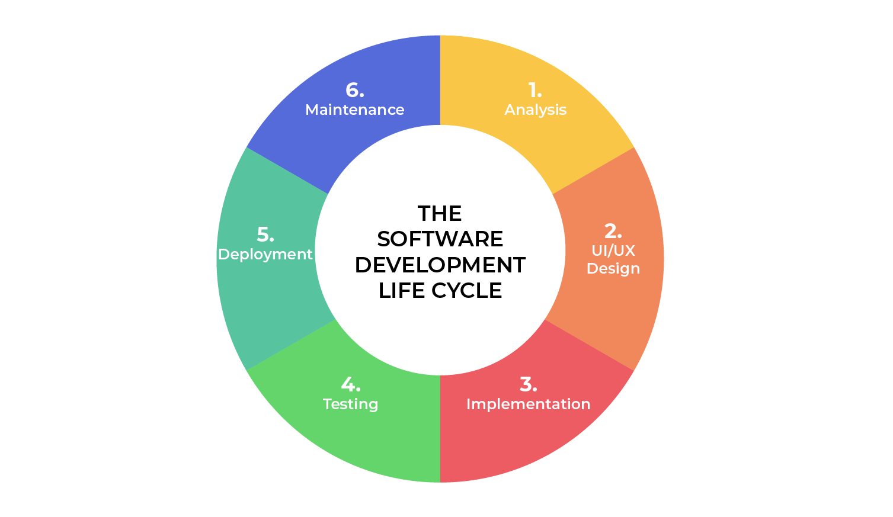
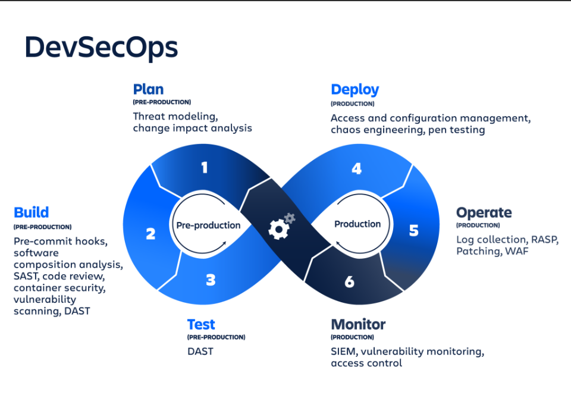
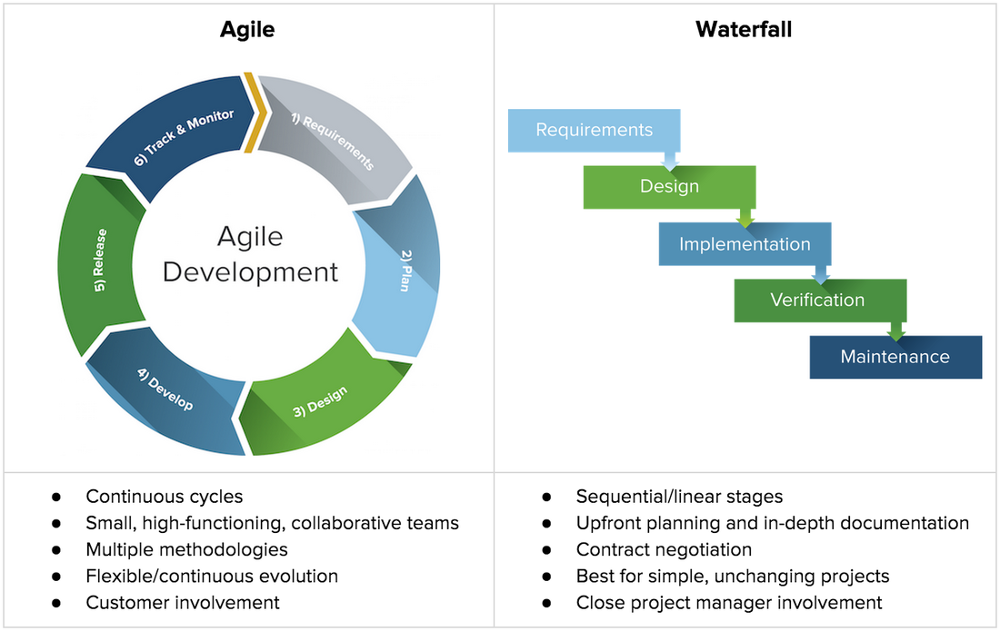
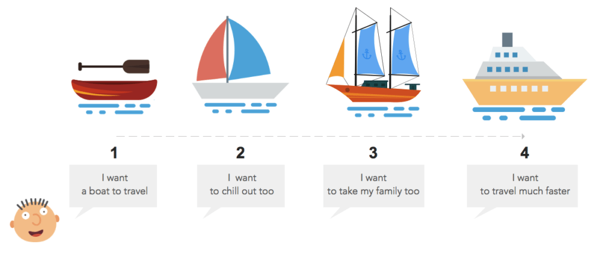

# DevOps Prozesse

## 1. Was ist SDLC (Software Development Life Cycle), und wie gliedert sich dieser Prozess?

SDLC heisst Software Development Life Cycle. Es ist ein Ablauf, wie Software geplant, gebaut, getestet und betrieben wird. Ziel ist es, gute und sichere Software in klaren Schritten zu entwickeln.

 
 
***Welche Schritte umfasst der SDLC, und wie tragen diese zur Entwicklung und Bereitstellung von Software bei?***
 
Die Phasen des SDLC:
 
Planung → Ziel und Umfang vom Projekt werden festgelegt.
 
Analyse → Anforderungen der Nutzer werden gesammelt.
 
Design → Entwurf für die Software entsteht.
 
Entwicklung → Programmierer schreiben den Code.
 
Test → Die Software wird auf Fehler und Qualität geprüft.
 
Bereitstellung → Software wird bei den Nutzern eingeführt.
 
Betrieb und Wartung → Die Software läuft und wird gepflegt.
 
 
***Wie wird der SDLC typischerweise in einem Projekt angewendet und gesteuert?***
 
Im Projekt wird der SDLC als Leitfaden genutzt. Er hilft, dass alle im Team wissen, was wann gemacht wird. Die Steuerung passiert oft durch Projektleiter oder mit Methoden wie Agile oder DevOps. Dabei wird darauf geachtet, dass Termine, Kosten und Qualität eingehalten werden. In moderner Entwicklung wird Sicherheit in jeden Schritt eingebaut, damit Probleme früh erkannt werden.

### Vertiefung

- Tests können unterschiedliche Formen haben: Unit Tests, Integrationstests, Systemtests oder User Acceptance Tests (UAT).
- Planung und Analyse sind entscheidend für Budgetkontrolle und Zeitmanagement.
- Wartung umfasst Bugfixes, Performance-Optimierungen und Sicherheitsupdates – oft der längste Teil des SDLC.
  
***Anwendungsbeispiele***

1. Bankensoftware:
- Hoher Sicherheitsbedarf → strikte SDLC-Phasen mit Reviews und Penetrationstests
- Jede Phase dokumentiert → regulatorische Anforderungen erfüllt

2. Webanwendungen (z. B. E-Commerce):
- Agile SDLC-Version → kurze Iterationen, schnelle Releases
- Testphase wird oft automatisiert (z. B. CI/CD-Pipelines)

3. Mobile Apps:
- MVP wird erstellt, Feedback gesammelt → nächste Entwicklungsphase angepasst
- Schnelle Bereitstellung über App Stores möglich

***Typische Anwendung und Steuerung im Projekt***

- Leitfaden: SDLC gibt dem Team Orientierung: Wer macht was und wann?
- Projektmanagement: Projektleiter überwachen Termine, Kosten und Qualität.
- Methoden:
  - Agile SDLC: Iterative Entwicklung, flexible Anpassungen
  - DevOps-Integration: Automatisierung von Tests, Deployment und Monitoring
- Sicherheitsaspekte: Security-by-Design wird in allen Phasen berücksichtigt → frühe Fehlererkennung, - geringere Kosten bei Bugfixes

### Quellen

- <https://www.redhat.com/de/topics/security/software-development-lifecycle-security>
- <https://aws.amazon.com/de/what-is/sdlc/>
- <https://www.rapid7.com/de/cybersecurity-grundlagen/software-development-life-cycle-sdlc/>
- <https://www.linkedin.com/pulse/software-development-life-cycle-sdlc-tutorial-richard-harris/>

## 2. Was ist der DevOps Lifecycle, und wie ist er strukturiert?

Der DevOps Lifecycle ist ein kontinuierlicher Prozess, der Entwicklung (Dev) und Betrieb (Ops) integriert, um die Softwareentwicklung zu optimieren und eine nahtlose Zusammenarbeit zu ermöglichen. Er ist in einem zyklischen Modell strukturiert, das Phasen wie Planung, Codierung, Integration, Testen, Deployment, Betrieb und Monitoring umfasst, die iterativ ablaufen, um kontinuierliche Verbesserungen zu gewährleisten.
 

 
***Wie ist der DevOps Lifecycle definiert, und welche Kernphasen beinhaltet er?***
 
Der DevOps Lifecycle wird als ein kollaborativer Ansatz definiert, der die Lücke zwischen Softwareentwicklung und IT-Betrieb schliesst, um eine kontinuierliche und automatisierte Bereitstellung zu erreichen. Zu den Kernphasen gehören Continuous Development, Continuous Integration, Continuous Testing, Continuous Deployment, Continuous Monitoring und Continuous Feedback, die in einem endlosen Loop organisiert sind.
 
 
***Welche Ziele verfolgt der DevOps Lifecycle im Vergleich zu traditionellen Entwicklungsansätzen?***
 
Der DevOps Lifecycle zielt darauf ab, die Entwicklungszeit zu verkürzen, die Qualität zu steigern und eine engere Zusammenarbeit zwischen Teams zu fördern, im Gegensatz zu traditionellen Ansätzen wie dem Wasserfall-Modell, die sequentiell und silobasiert sind. Im Vergleich zu klassischen Methoden reduziert er Risiken durch Automatisierung und kontinuierliches Feedback, was schnellere Releases und bessere Anpassungsfähigkeit an Veränderungen ermöglicht.

### Vertiefung
 
- **Continuous Integration**: Code wird täglich in kleine Batches integriert, automatisiert getestet (z.B. mit Jenkins), um Konflikte früh zu erkennen.  
- **Continuous Deployment**: Features werden in kleinen, automatisierten Releases bereitgestellt, z.B. via Kubernetes, um Risiken zu minimieren.  
- **Continuous Monitoring**: Echtzeit-Analyse von Metriken (z.B. mit Prometheus) ermöglicht proaktive Optimierungen basierend auf Nutzerdaten.  
- **DevSecOps**: Security-Checks (z.B. OWASP-Scans) sind in jede Phase eingebettet, um frühzeitig Schwachstellen zu beheben.  
- **Messbarkeit**: KPIs wie Deployment-Frequenz, Fehlerquote oder Ladezeiten werden analysiert, um datenbasierte Entscheidungen zu fördern.
 
 
***Anwendungsbeispiele***
 
- **FinTech**:  
  Ein Startup entwickelt eine Zahlungs-App mit Basisfunktion (z.B. Überweisungen), deployt sie via CI/CD, sammelt Feedback und fügt Features wie Budget-Tracking hinzu.
 
- **Gaming**:  
  Ein Studio released ein Spiel mit minimalen Features (z.B. Einzelspieler-Modus), nutzt Continuous Monitoring für Crash-Reports und deployt Multiplayer-Updates basierend auf Spieler-Feedback.
- **Logistik**:  
  Eine Lieferplattform führt eine Tracking-Funktion ein, testet sie in einer Region via Canary-Release, analysiert Nutzerdaten und optimiert die Funktion vor globalem Rollout.
 
***Gegenüberstellung: DevOps vs. Waterfall***
 
| Aspekt                    | DevOps                                    | Waterfall                                |
|---------------------------|-------------------------------------------|------------------------------------------|
| **Prozessstruktur**       | Iterativ, kontinuierlich, zyklisch        | Linear, sequentiell, phasenbasiert       |
| **Ziel**                  | Schnelle Releases, Feedback, Anpassung    | Definierte Projektziele, Stabilität      |
| **Risiko**                | Gering durch kleine, automatisierte Releases | Höher durch späte Tests und Integration |
| **Zeit bis Markteinführung** | Kurz (täglich/wöchentlich)              | Lang (Monate/Jahre)                     |
| **Flexibilität**          | Hoch, Änderungen jederzeit möglich        | Niedrig, Änderungen kostenintensiv       |

### Quellen

- <https://www.browserstack.com/guide/devops-lifecycle>
- <https://www.geeksforgeeks.org/devops/devops-lifecycle/>
- <https://roadmap.sh/devops/lifecycle>
- <https://unity.com/de/topics/devops-lifecycle>
- <https://www.cloudzero.com/blog/devops-lifecycle/>
- <https://www.harness.io/blog/devops-lifecycle>
- <https://octopus.com/blog/devops-versus-sdlc>
- <https://www.piazzablu.com/devops>
- <https://kruschecompany.com/de/devops-guide/>

## 3. Unterschiede zwischen SDLC und DevOps Lifecycle

### Wie unterscheiden sich die Ansätze, Prozesse und Ziele dieser beiden Modelle?

Der **SDLC (Software Development Life Cycle)** folgt einem phasenbasierten, oft sequenziellen Ansatz, bei dem die Softwareentwicklung in klar definierte Schritte wie Planung, Design, Implementierung, Test und Deployment unterteilt wird. Die Zusammenarbeit zwischen Entwicklung und Betrieb ist häufig getrennt, und die Prozesse sind stark dokumentiert und kontrolliert. Das Ziel liegt auf der planmäßigen Fertigstellung und Auslieferung eines stabilen Produkts.

Der **DevOps Lifecycle** hingegen integriert Entwicklung und Betrieb in einem kontinuierlichen Prozess. Er setzt auf Automatisierung (Continuous Integration, Continuous Deployment) und schnelle Feedbackschleifen, um Software schneller und häufiger auszuliefern. Die Kultur der Zusammenarbeit steht im Mittelpunkt, um agile Anpassungen und kontinuierliche Verbesserung zu ermöglichen.

### Welche Auswirkungen haben diese Unterschiede auf die Entwicklung, Bereitstellung und den Betrieb von Software?

Durch die Trennung der Phasen im SDLC sind Entwicklungszyklen oft länger, Feedback kommt verzögert, und Änderungen sind weniger flexibel umzusetzen. Die Bereitstellung erfolgt meist als großer Meilenstein.

Im DevOps Lifecycle ermöglichen automatisierte Pipelines und enge Zusammenarbeit schnelle, häufige Releases, wodurch Fehler schneller erkannt und behoben werden können. Dies führt zu höherer Agilität, besserer Stabilität im Betrieb und einer stärkeren Ausrichtung an Kundenbedürfnissen.

### Zusammenfassung

| Aspekt              | SDLC                                   | DevOps Lifecycle                        |
|---------------------|---------------------------------------|---------------------------------------|
| Ansatz              | Phasenorientiert, sequenziell         | Kontinuierlich, integriert             |
| Zusammenarbeit      | Entwicklung und Betrieb getrennt       | Entwicklung und Betrieb vereint        |
| Ziel                | Planungssicherheit, vollständiges Produkt | Schnelle Auslieferung, kontinuierliche Verbesserung |
| Feedbackzyklus      | Langsam, nach Abschluss der Phasen    | Schnell, kontinuierlich                 |
| Automatisierung     | Gering bis mittel                      | Hoch, CI/CD-Pipelines    

### Quellen

- <https://jfrog.com/de/learn/sdlc/>
- <https://www.ovhcloud.com/de/learn/what-is-sdlc/>
- <https://www.redhat.com/de/topics/security/software-development-lifecycle-security>
- <https://www.browserstack.com/guide/devops-lifecycle>
- <https://www.rapid7.com/de/cybersecurity-grundlagen/software-development-life-cycle-sdlc/>
- <https://www.geeksforgeeks.org/devops/devops-lifecycle/>
- <https://www.computertechreviews.com/sdlc-vs-devops-which-is-better/>

## 4. Was ist ein MVP (Minimum Viable Product), und welche Bedeutung hat es im DevOps Lifecycle?

Ein MVP ist die kleinste funktionsfähige Version eines Produkts, die mit minimalem Aufwand auf den Markt gebracht wird, um Feedback echter Nutzer zu sammeln.
 
Ziel: Risiken reduzieren, schneller lernen, unnötige Kosten vermeiden

 
 
***Wie wird ein MVP definiert, und welche Kernmerkmale zeichnen es aus?***
 
Ein MVP ist eine Version eines Produkts mit nur den wichtigsten Funktionen, die den Nutzern trotzdem einen klaren Nutzen bietet. Es ist kein reiner Prototyp, sondern schon ein Produkt, das auf den Markt kann. Wichtige Merkmale sind: einfach zu benutzen, funktioniert zuverlässig, zeigt das wichtigste besondere Merkmal des Produkts und kann durch Feedback und Erweiterungen weiter verbessert werden.

***Welche Rolle spielt das MVP in den verschiedenen Phasen des DevOps Lifecycles, insbesondere im Hinblick auf schnelles Feedback und iterative Verbesserung?***

Ein MVP spielt im DevOps-Lifecycle eine zentrale Rolle, indem es in den Phasen Planung, Entwicklung und Bereitstellung schnelles Feedback von Kunden ermöglicht, um Hypothesen zu validieren und Risiken zu minimieren. Durch iterative Verbesserungen basierend auf diesem Feedback, insbesondere in den Phasen Testen und Überwachen, wird das Produkt kontinuierlich an Kundenbedürfnisse angepasst, was die Effizienz und Marktakzeptanz steigert.

### Vertiefung

- ***Integration in DevOps***: MVPs werden oft als erste Version innerhalb einer Continuous Deployment Pipeline bereitgestellt.
- ***Iterative Weiterentwicklung***: Nach Veröffentlichung sammelt das Team kontinuierlich Feedback, testet neue Features und deployt Updates in kurzen Zyklen.
- ***Risikominimierung***: Frühes Testen am Markt reduziert die Wahrscheinlichkeit teurer Fehlentwicklungen.
- ***Messbarkeit***: KPI wie Nutzerinteraktion, Retention oder Conversion können früh analysiert werden, um Entscheidungen datenbasiert zu treffen.

***Anwendungsbeispiele***

1. Startups:
- Ein kleines Team entwickelt eine App mit nur einer Kernfunktion, bringt sie auf den Markt und beobachtet, wie Nutzer reagieren.
2. E-Commerce:
- Einführung eines neuen Features (z. B. Wunschliste) nur mit Basisfunktionalität → Feedback fließt in die Version 2 ein.
3. SaaS-Produkte:
- MVP enthält nur ein zentrales Modul, während weitere Module erst nach Nutzerfeedback entwickelt werden.

***Gegenüberstellung: MVP vs. fertiges Produkt***

| Aspekt             | MVP                         | Fertiges Produkt                     |
|--------------------|-----------------------------|------------------------------------|
| Funktionsumfang    | Minimal, Kernfunktionen      | Vollständig, alle geplanten Features |
| Ziel               | Feedback und Lernprozess     | Markt- oder Geschäftsziel           |
| Risiko             | Gering, da wenig Ressourcen investiert | Höher, da komplette Entwicklungskosten |
| Zeit bis Markteinführung | Kurz                      | Länger                             |
| Flexibilität       | Hoch, Anpassungen leicht möglich | Niedriger, Änderungen kostenintensiver |

### Quellen

- <https://asana.com/de/resources/minimum-viable-product>
- <https://monday.com/blog/de/projektmanagement/minimum-viable-product/>
- <https://www.fme.de/blog/warum-und-wie-definiert-man-eigentlich-ein-minimum-viable-product-mvp/>
- <https://www.awork.com/de/glossary/mvp-minimum-viable-product>
- <https://www.pureconsultant.de/de/scrum/minimum-viable-product-mvp-scrum/>
- <https://www.cobbleweb.co.uk/ultimate-guide-to-minimum-viable-product-mvp/>