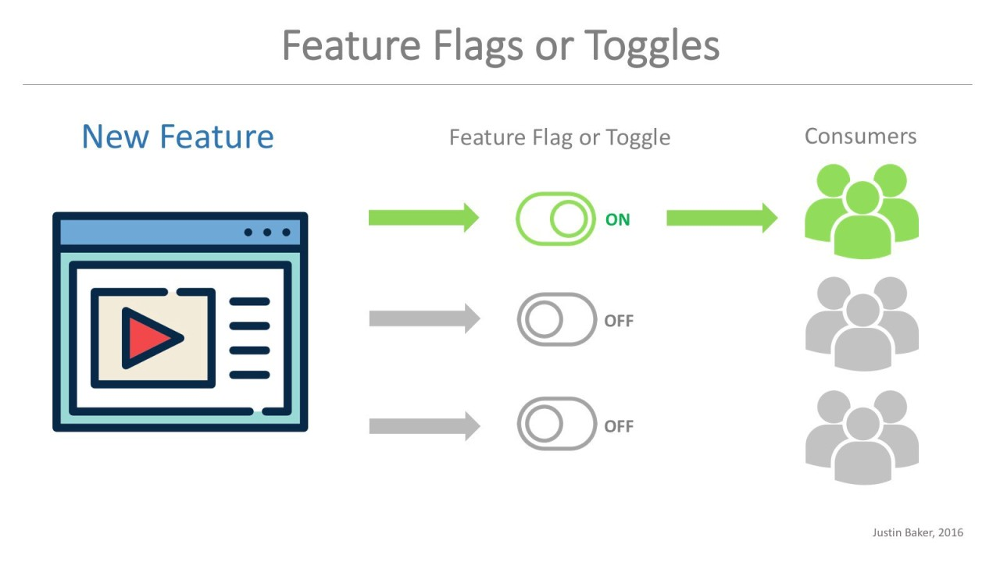

# Continuous Deployment & Deployment-Strategien

## 1. Was ist Continuous Deployment und wie wird es umgesetzt?

**Continuous Deployment (CD)** ist eine fortschrittliche Praxis in der modernen Softwareentwicklung, bei der jede Codeänderung, die alle automatisierten Tests erfolgreich durchlaufen hat, automatisch in die Produktionsumgebung übertragen wird, ohne dass ein menschliches Eingreifen erforderlich ist. Ziel ist es, die Geschwindigkeit der Softwarelieferung zu erhöhen, die Feedback-Zyklen zu verkürzen und eine hohe Zuverlässigkeit bei der Veröffentlichung neuer Funktionen, Updates oder Fehlerbehebungen sicherzustellen.

### Umsetzung:
- **Automatisierte Tests:** Der Grundstein für Continuous Deployment sind umfassende, automatisierte Tests. Diese umfassen Unit-Tests, um einzelne Komponenten zu prüfen, Integrationstests, die das Zusammenspiel verschiedener Module validieren, sowie End-to-End-Tests, die den Nutzerfluss simulieren (z.B. mit Cypress oder Selenium). Diese Tests werden in der CI/CD-Pipeline automatisch ausgeführt, um die Stabilität jedes Builds sicherzustellen.
- **Automatisierte Deployment-Pipeline:** Plattformen wie Jenkins, GitLab CI/CD, GitHub Actions oder CircleCI orchestrieren den gesamten Prozess, vom Code-Commit bis zur Bereitstellung in der Produktionsumgebung. Nach erfolgreichem Testlauf erfolgt das automatische Deployment, was eine kontinuierliche Lieferung ohne Verzögerungen ermöglicht.
- **Feature Toggles:** Mit Hilfe von Feature Flags, beispielsweise LaunchDarkly oder Unleash, können neue Funktionen im Code enthalten, aber erst bei Bedarf aktiviert werden. Das erlaubt es, Risiken zu minimieren, da neue Features gezielt ausgerollt und bei Problemen sofort deaktiviert werden können.
- **Monitoring:** Nach der automatischen Freigabe wird das System durch Monitoring-Tools wie Prometheus, Grafana oder Splunk überwacht. Diese erkennen Performance-Probleme, unerwartete Fehler oder Sicherheitsvorfälle frühzeitig, sodass schnelle Reaktionen möglich sind.

### Beispiel:
In einem Cloud-basierten Microservices-Architektur-Setup auf Kubernetes wird für jede Codeänderung eine CI/CD-Pipeline gestartet, die den Code baut, testet und bei Erfolg automatisch in den Cluster deployed. Neue Features werden per Feature Toggle nur schrittweise für ausgewählte Nutzergruppen sichtbar gemacht, um Risiken zu minimieren und schnelle Rückkopplung zu ermöglichen.

### Vorteile:
- Durch die Automatisierung können Fehler bei manuellen Eingriffen vermieden und Reaktionszeiten bei Problemen deutlich verkürzt werden.
- Häufige Integration führt zu weniger Merge-Konflikten und erhöht die Codequalität.
- Die kontinuierliche Automatisierung schafft eine stabilere und zuverlässigere Softwarelieferkette.

### Quellen:
- [mindsquare](https://mindsquare.de/knowhow/continuous-deployment/#:~:text=Continuous%20Deployment%20stellt%20den%20abschließenden,Continuous%20Delivery%20konsequent%20umgesetzt%20werden.)

-  [IBM](https://www.ibm.com/de-de/think/topics/continuous-deployment)

-  [entwickler](https://entwickler.de/devops/roadmap-einer-spannenden-reise)

---

## 2. Unterschied zwischen Continuous Deployment und Continuous Delivery

  

In der Praxis werden die Begriffe häufig synonym verwendet, jedoch gibt es klare Unterschiede:

| Aspekt               | Continuous Delivery (CD)                                   | Continuous Deployment                                                   |
|----------------------|--------------------------------------------------------------|---------------------------------------------------------------------------|
| Automatisierung      | Bis zu einer staging-ähnlichen Umgebung, z.B. Test- oder Pre-Produktionsumgebung | Bis in die eigentliche Produktionsumgebung, ohne menschliches Eingreifen   |
| Manuelle Freigabe    | Ja, meist durch einen Release-Manager oder Product Owner    | Nein, der Release erfolgt vollautomatisch, sobald alle Tests bestanden sind |
| Risiko bei Fehlern   | Gering, durch manuelle Kontrolle und Freigabe                | Höher, weil Fehler automatisch veröffentlicht werden könnten             |
| Kontrolle            | Höhere Kontrolle, z.B. bei Einhaltung regulatorischer Vorgaben | Geringere Kontrolle, schnellere Reaktionsfähigkeit                     |

### Vertiefung:
Während bei Continuous Delivery die letzten Schritte der Freigabe manuell erfolgen, ist bei Continuous Deployment die Automatisierung so weit ausgebaut, dass jede funktionierende Änderung sofort live geschaltet wird. Unternehmen wählen je nach Risikoakzeptanz und regulatorischen Anforderungen die passende Strategie.

### Quellen:
- [Puppet: Continuous Delivery vs. Deployment](https://puppet.com/blog/continuous-delivery-vs-deployment/)
- [AWS: Continuous Delivery vs. Deployment](https://aws.amazon.com/devops/continuous-delivery/)

- [atlassian: Continuous Delivery vs. Deployment](https://www.atlassian.com/continuous-delivery/principles/continuous-integration-vs-delivery-vs-deployment)

---

## 3. Vor- und Nachteile von Continuous Delivery und Continuous Deployment

### Continuous Delivery

**Vorteile:**  
- Bietet maximale Kontrolle durch manuelle Freigabe, ideal bei hohen Sicherheits- oder Compliance-Anforderungen.  
- Ermöglicht eine koordinierte Planung von Releases, z.B. in Abstimmung mit Marketing oder Support.  
- Reduziert das Risiko durch gründliche Review- und Freigabeprozesse vor der Live-Schaltung.

**Nachteile:**  
- Führt zu längeren Release-Zyklen, da manuelle Schritte Zeit in Anspruch nehmen.  
- Erhöht den manuellen Aufwand, was Fehlerquellen birgt und die Automatisierung einschränkt.

### Continuous Deployment

**Vorteile:**  
- Ermöglicht eine extrem schnelle Reaktion auf Nutzerfeedback oder Marktveränderungen.  
- Minimiert manuelle Eingriffe, was die Fehlerquote reduziert und die Automatisierung stärkt.  
- Nutzer profitieren von kontinuierlichen Verbesserungen in kurzen Abständen.

**Nachteile:**  
- Höheres Risiko bei Fehlern, insbesondere bei unzureichend getesteten Änderungen.  
- Erfordert robuste automatisierte Tests und umfangreiches Monitoring, um Fehler schnell zu erkennen und zu beheben.

### Beispiel:
Ein SaaS-Anbieter nutzt Canary-Deployments, um neue Funktionen zunächst nur einer kleinen Nutzergruppe bereitzustellen. Bei positiven Rückmeldungen wird die Rollout-Umfang schrittweise erhöht, um Fehler frühzeitig zu erkennen.

### Quellen:

- [octopus](https://octopus-com.translate.goog/devops/continuous-deployment/?_x_tr_sl=en&_x_tr_tl=de&_x_tr_hl=de&_x_tr_pto=rq#:~:text=Benefits%20of%20Continuous%20Deployment&text=Continuous%20Deployment%20significantly%20speeds%20up,improvements%20faster%20than%20ever%20before.)

- [entwickler](
https://entwickler.de/continuous-delivery/continuous-deployment-fluch-oder-segen)

---

## 4. Deployment-Strategien

### 4.1 Blue/Green Deployment

**Beschreibung:**  
Bei dieser Strategie existieren zwei identische Produktionsumgebungen, genannt „Blue“ und „Green“. Während die „Blue“-Umgebung den aktuellen Live-Betrieb führt, wird die „Green“-Umgebung mit der neuen Version vorbereitet. Nach erfolgreichen Tests wird der Traffic auf die „Green“-Umgebung umgeschaltet. Bei Problemen kann sofort wieder auf die alte Version umgeschaltet werden.

**Vorteile:**  
- Minimiert Ausfallzeiten, da der Traffic schnell umgeleitet werden kann.  
- Schnelles Rollback möglich, falls Probleme auftreten.  
- Keine Downtime während des Deployments, was besonders bei kritischen Anwendungen essenziell ist.

**Abbildung 3: Blue/Green Deployment**

  

**Quellen:**  

- [worldofvr: Blue/Green](https://worldofvr.de/blue-green-deployment)

-  [Redhat: Blue/Green](https://www.redhat.com/en/topics/devops/what-is-blue-green-deployment)

-  [digitalvarys: Blue/Green](https://digitalvarys.com/what-is-blue-green-deployment)

---

### 4.2 Canary Deployment

**Beschreibung:**  
Hierbei wird die neue Version nur an eine kleine Nutzergruppe ausgerollt, z.B. 5% der Endnutzer. Bei Erfolg wird die Verteilung schrittweise erhöht, bis die gesamte Zielgruppe erreicht ist. Bei auftretenden Problemen kann das Deployment sofort gestoppt oder rückgängig gemacht werden, ohne die gesamte Nutzerbasis zu beeinträchtigen.

**Vorteile:**  
- Frühe Fehlererkennung durch Test in der echten Nutzerumgebung.  
- Geringeres Risiko, da nur eine kleine Gruppe betroffen ist.  
- Nutzerfeedback kann frühzeitig integriert werden.

**Beispiel:**  
Ein soziales Netzwerk führt eine neue Profilfunktion zunächst nur für 1% der Nutzer ein. Bei positiven Rückmeldungen wächst die Verteilung auf 10%, 25%, 50% und schliesslich 100%, ohne das Risiko eines grossflächigen Fehlers.

  

**Quellen:**  
- [Google Cloud: Canary Deployment](https://cloud.google.com/deploy/docs/deployment-strategies/canary)  
- [Codefresh: Canary Deployments](https://codefresh.io/learn/software-deployment/what-are-canary-deployments/)

---

## 5. Was ist A/B-Testing?

**Definition:**  
A/B-Testing ist eine Methode, bei der zwei Varianten eines Produkts (z.B. Webseite, App-Feature) parallel getestet werden, um zu ermitteln, welche Variante bessere Nutzer-Interaktionen, Konversionen oder andere Erfolgskriterien erzielt. Ziel ist es, datenbasiert Entscheidungen zu treffen und die Nutzererfahrung kontinuierlich zu optimieren.

**Anwendungsbeispiele:**  
- UI-Design: Button-Farbe, Layout, Platzierung  
- Neue Features: Funktionalitäten, die nur bei ausgewählten Nutzern getestet werden  
- Preisgestaltung: Verschiedene Preismodelle in Vergleich setzen

**Tools:**  
VWO, Optimizely, Google Optimize

**Vorteile:**  
- Basiert auf realen Nutzer-Daten und nicht auf Annahmen  
- Schnelle Validierung von Hypothesen  
- Optimierung der Conversion-Rate oder Nutzerbindung in kurzer Zeit

  

**Quellen:**  
- [VWO: A/B Testing](https://vwo.com/ab-testing/)  
- [Optimizely: A/B Testing](https://www.optimizely.com/optimization-glossary/ab-testing/)

---

## 6. Was sind Feature Toggles?

**Definition:**  
Feature Toggles (auch Feature Flags) sind eine Technik, bei der einzelne Funktionen im laufenden Betrieb aktiviert oder deaktiviert werden können, ohne dass eine neue Version deployed werden muss. Damit lassen sich neue Features schrittweise ausrollen, Nutzergruppen gezielt ansprechen oder bei Problemen schnell reagieren.

**Nutzung:**  
- Für A/B-Tests oder Nutzergruppen-spezifische Features  
- Schnelles Deaktivieren bei auftretenden Fehlern  
- Staged Rollouts in produktiven Umgebungen

**Tools:**  
LaunchDarkly, Unleash, Flagger

**Vorteile:**  
- Erhöhte Flexibilität bei Releases  
- Schnelle Reaktion auf Fehler oder Sicherheitsprobleme  
- Möglichkeit, Features in der Produktion zu testen, ohne den Code zu verändern

**Nachteile:**  
- Erhöhte Code-Komplexität durch viele toggles  
- Gefahr, dass toggles im Code vergessen werden und ihn unnötig aufblähen

  

**Quellen:**  
- [Martin Fowler: Feature Toggles](https://martinfowler.com/articles/feature-toggles.html)  
- [Optimizely: Feature Toggles](https://www.optimizely.com/optimization-glossary/feature-toggle/)

---

## 7. Was sind Rollback-Strategien?

**Automatisierte Rollbacks:**  
Bei kritischen Fehlern oder Sicherheitsvorfällen kann das Deployment-Tool (z.B. Kubernetes, Jenkins) automatisiert eine vorherige stabile Version wiederherstellen, um die Ausfallzeit zu minimieren.

**Manuelle Rollbacks:**  
Das Entwicklerteam kann bei Bedarf eine vorherige Version manuell wieder bereitstellen, z.B. durch erneutes Deployment oder Wiederherstellung eines Backups.

**Best Practices:**  
- Schnelles Erkennen von Problemen durch Monitoring und Alerts  
- Verwendung von Versionierungssystemen (z.B. Git-Tags) für einfache Rückkehr  
- Einsatz von Blue/Green oder Canary-Strategien erleichtert das schnelle Zurücksetzen

**Quellen:**  
- [Octopus Deploy: Rollback-Strategien](https://octopus.com/blog/modern-rollback-strategies)  
- [AWS: Rollback-Strategien](https://aws.amazon.com/builders-library/ensuring-rollback-safety-during-deployments/)

---

## 8. Was ist Continuous Monitoring und wie wird es umgesetzt?

  

**Beschreibung:**  
Continuous Monitoring bedeutet, dass die Systemleistung, Verfügbarkeit, Sicherheitsereignisse, Nutzerinteraktionen und Fehler kontinuierlich erfasst und ausgewertet werden. Ziel ist es, proaktiv auf Probleme zu reagieren, bevor sie sich auf die Nutzer auswirken.

**Vorgehen:**  
- Einrichtung von Dashboards mit wichtigen KPIs (z.B. Responsezeiten, Auslastung)  
- Automatisierte Alarmierung bei Überschreitung vordefinierter Schwellenwerte  
- Log-Analyse, um Sicherheitsverletzungen oder Fehlerquellen zu identifizieren

**Beispiel:**  
Ein Webservice überwacht die Antwortzeiten. Bei Überschreitung der Grenzwerte werden automatisch Warnungen an das Team gesendet, um Gegenmassnahmen einzuleiten.

**Quellen:**  
- [Splunk: Continuous Monitoring](https://www.splunk.com/en_us/blog/learn/continuous-monitoring.html)  
- [NIST: Continuous Monitoring](https://csrc.nist.gov/glossary/term/continuous_monitoring)

---

## 9. Wie werden Passwörter sicher gespeichert?

**Methoden:**  
- **Hashing:** Verwendung starker Hash-Algorithmen wie bcrypt, Argon2 oder PBKDF2, die speziell für Passwörter entwickelt wurden.  
- **Salting:** Zufällige, pro Nutzer generierte Salze werden vor das Hashing gesetzt, um Rainbow-Table-Angriffe zu verhindern.  
- **Verschlüsselung:** Sensible Daten können verschlüsselt gespeichert werden, z.B. mit Hardware Security Modules (HSM) oder sicheren Schlüsselspeichern.

**Best Practices:**  
- Hashing nur mit speziell für Passwörter geeigneten Algorithmen durchführen.  
- Salz pro Nutzer individuell generieren und sicher speichern.  
- Schlüsselmanagement zentral und sicher gestalten, z.B. mit Cloud KMS oder HSMs.

**Quellen:**  
- [OWASP: Password Storage Cheat Sheet](https://cheatsheetseries.owasp.org/cheatsheets/Password_Storage_Cheat_Sheet.html)  
- [Bitwarden: Password Manager](https://www.wired.com/review/bitwarden-password-manager)

---

## 10. Welche Arten von Deployments gibt es? (Möglichkeiten & Voraussetzungen)

**Mögliche Deployment-Methoden:**  
- **Direktes Deployment auf Server:** Kompilieren und Hochladen des Codes direkt auf den Ziel-Server mittels SCP, FTP oder manuellem Upload.  
- **Containerisierung:** Einsatz von Docker-Containern, die portabel sind und auf jeder Plattform laufen, die Docker unterstützt.  
- **Orchestrierung:** Nutzung von Kubernetes, Docker Swarm oder OpenShift für skalierte, automatisierte Deployments in grossen Umgebungen.  
- **Serverless Deployment:** Einsatz von Cloud-Functions wie AWS Lambda, Google Cloud Functions oder Azure Functions, bei denen der Code in einer verwalteten Umgebung läuft, ohne dass Servermanagement erforderlich ist.  
- **Platform-as-a-Service (PaaS):** Nutzung von Plattformen wie Heroku oder Google App Engine, bei denen die Infrastruktur automatisch bereitgestellt und verwaltet wird.

**Voraussetzungen:**  
- Für Docker: Installation der Docker Engine, Kenntnisse in Docker Compose.  
- Für Kubernetes: Ein Cluster mit entsprechender Konfiguration.  
- Für Serverless: passende Cloud-Provider-Konten und SDKs.  
- Für CI/CD: Automatisierungstools wie Jenkins, GitLab CI oder Azure DevOps.

**Beispiel:**  
Ein Unternehmen setzt Kubernetes ein, um eine Vielzahl von Microservices zu verwalten. Bei jedem neuen Release werden rolling updates durchgeführt, um Downtime zu vermeiden und eine kontinuierliche Verfügbarkeit zu sichern.

**Quellen:**  
- [Docker: Deployment with Docker](https://www.docker.com/resources/what-container)  
- [Kubernetes: Deployment](https://kubernetes.io/docs/concepts/workloads/controllers/deployment/)  

---

# Fazit

Die konsequente Anwendung und Kombination dieser Strategien, Tools und Methoden ermöglicht eine schnelle, zuverlässige und sichere Softwarebereitstellung. Dabei spielen Automatisierung, Monitoring und Sicherheitsmassnahmen eine zentrale Rolle, um Fehler zu minimieren und die Nutzererfahrung kontinuierlich zu verbessern. 
